# VideoLab - High-performance and flexible video editing and effects framework

## What is VideoLab?

VideoLab is an open source, high-performance and flexible iOS video editing and effects framework that offers a more AE (Adobe After Effect) approach to use. The core of the framework is based on AVFoundation and Metal. Currently available features: 

* High-performance real-time video editing and exporting.
* Highly free combination of video, image, audio.
* Support audio pitch setting and volume adjustment.
* Support CALayer vector animations, so complex text animations are supported.
* Support keyframe animation.
* Support After Effect-like pre-compose.
* Support transitions.
* Support custom effects. Such as LUT filter, zoom blur, etc.

The following are some GIFs of features(multiple layers, text animation, keyframe animation, pre compose, and transition)

<p align="left">
    
    
    
    
    
</p>

Github repo: https://github.com/ruanjx/VideoLab

In this article, we will share the AVFoundation video editing workflow, and the design and implementation of the VideoLab framework.

## AVFoundation video editing workflow

Before we begin, it is recommended that those who are new to video editing watch the following WWDC video: 

* [Advanced Editing with AV Foundation](https://developer.apple.com/videos/play/wwdc2013/612/)
* [Edit and play back HDR video with AVFoundation](https://developer.apple.com/videos/play/wwdc2020/10009/)

Let's have a look at the overall workflow of AVFoundation video editing: 

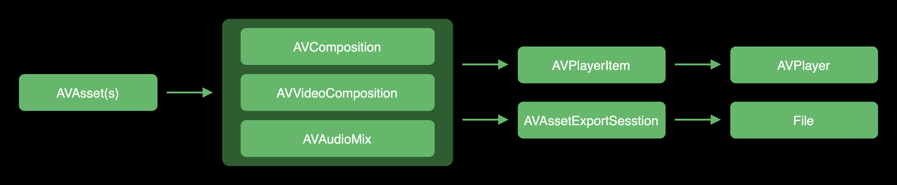

Let's break down the steps:

1. Create one or more `AVAsset`.
2. Create `AVComposition`, `AVVideoComposition` and `AVAudioMix`. `AVComposition` specifies the temporal alignment of the source tracks. `AVVideoComposition` specifies geometry transformation and blending of tracks at any given time point, and `AVAudioMix` manages the mixing parameters of the audio tracks.
3. we can use these three objects to create `AVPlayerItem` and from it we can create an `AVPlayer` to play editing effects.
4. In addition, we can also use these three objects to create `AVAssetExportSession` to write the editing results to a file.

### AVComposition

Let's begin by looking at `AVComposition`, which is a collection of one or more `AVCompositionTrack` audio and video tracks. Where `AVCompositionTrack` can contain `AVAssetTrack` from multiple `AVAsset`.

In the following illustration, the audio/video `AVAssetTrack` from two `AVAssets` are combined into the audio/video `AVCompositionTrack` of `AVComposition`.

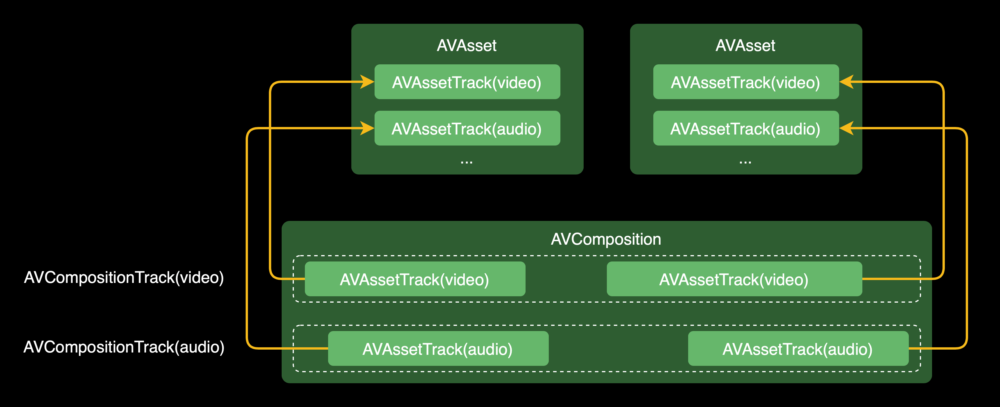

### AVVideoComposition

Imagine the scene shown below, where `AVComposition` contains two `AVCompositionTrack`. We need to blend the images of both `AVCompositionTrack` at time point T1. To do this, we need to use `AVVideoComposition`.

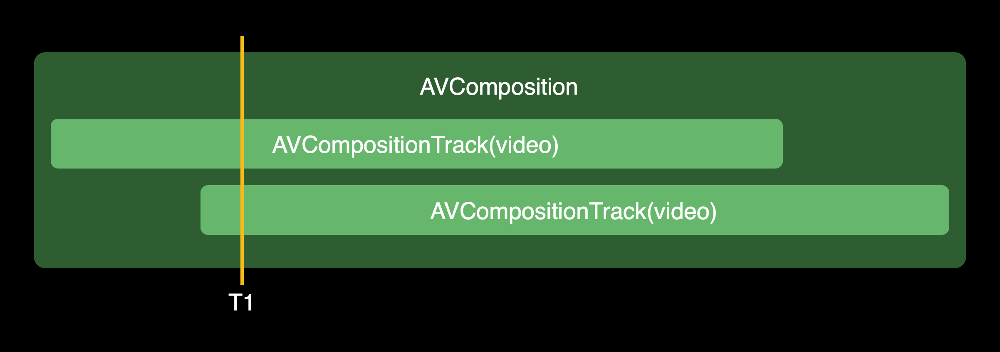

`AVVideoComposition` can be used to specify the render size and render scaling, as well as the frame rate. In addition, an array of Instructions implementing the `AVVideoCompositionInstructionProtocol` protocol is stored, and these Instructions store blending parameters. With these blending parameters, `AVVideoComposition` can blend the corresponding image frames with a Compositor that implements the `AVVideoCompositing` protocol.

The overall workflow is shown in the following illustration:

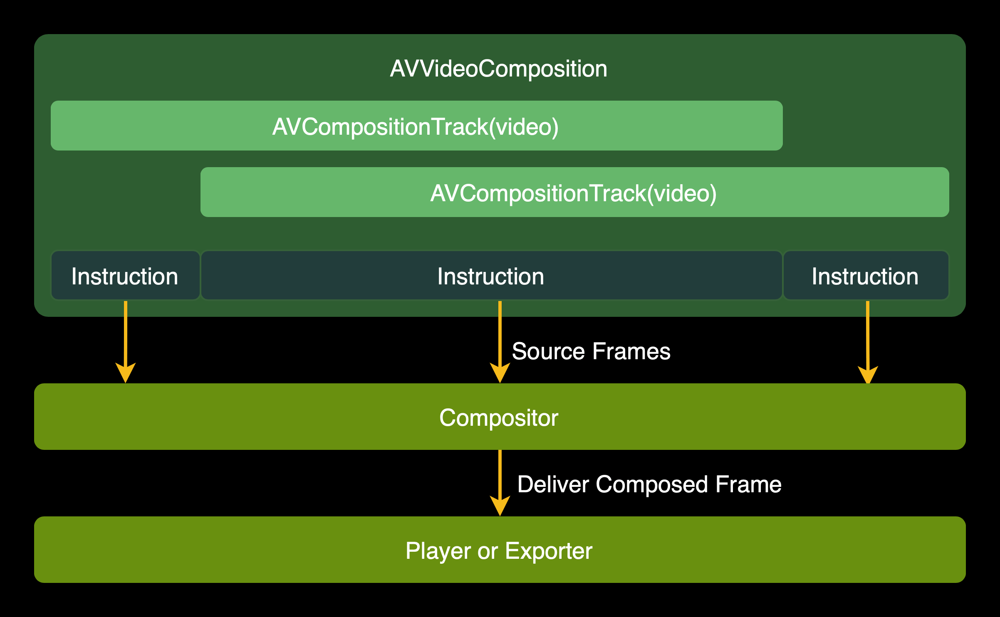


Let's focus on Compositor, where we have multiple original frames that need to be processed and a new one output. The workflow is shown in the following diagram:

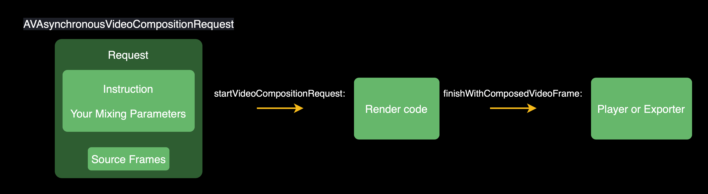

The flow can be broken down as following:

1. `AVAsynchronousVideoCompositionRequest` binds a series of original frames for current time, and the Instruction where the current time is located.
2. The `startVideoCompositionRequest:` callback is received, and the Request is taken.
3. Render the composite frame based on the original frame and the instruction-related blending parameters.
4. Call `finishWithComposedVideoFrame:` to deliver the rendered frame.

### AVAudioMix

Using `AVAudioMix`, you can process audio on the audio track of `AVComposition`. `AVAudioMix` contains a set of `AVAudioMixInputParameters`, each `AVAudioMixInputParameters` corresponds to an audio `AVCompositionTrack`. This is shown in the following illustration: 

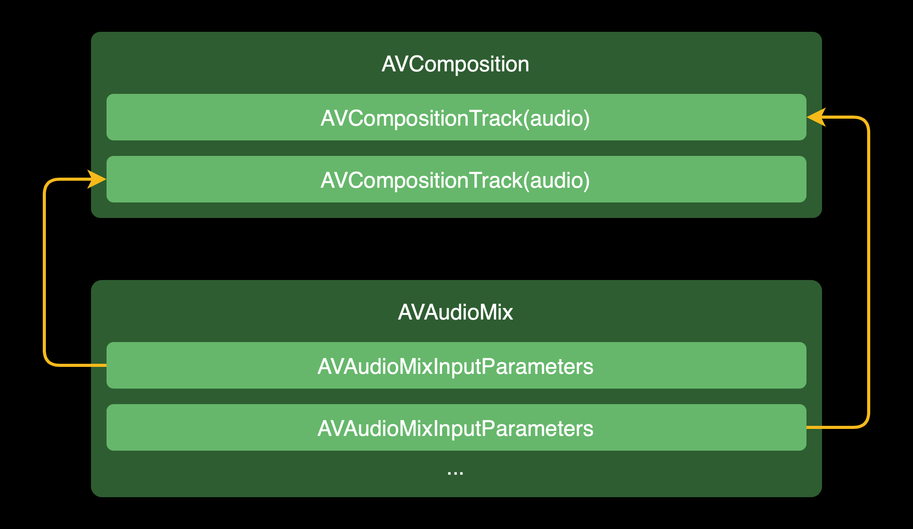

`AVAudioMixInputParameters` contains an `MTAudioProcessingTap` that you can use to process audio in real time. Of course, for linear volume changes you can directly use the volume ramp interface `setVolumeRampFromStartVolume:toEndVolume:timeRange:`

In addition, `AVAudioMixInputParameters` also contains an `AVAudioTimePitchAlgorithm` that you can use to set the pitch.

## Design of the framework

We introduced the AVFoundation video editing process before, and now we will introduce the design of the VideoLab framework.

First, let's briefly introduce AE (Adobe After Effect), a motion graphics and visual effects software commonly used by special effects designers (see the [AE website](https://www.adobe.com/cn/products/aftereffects.html) for more information). AE controls the compositing of video, audio, and still images through "layers", and each media (video, audio, and still image) object has its own separate track.

The following illustration is an example of compositing two videos in AE.

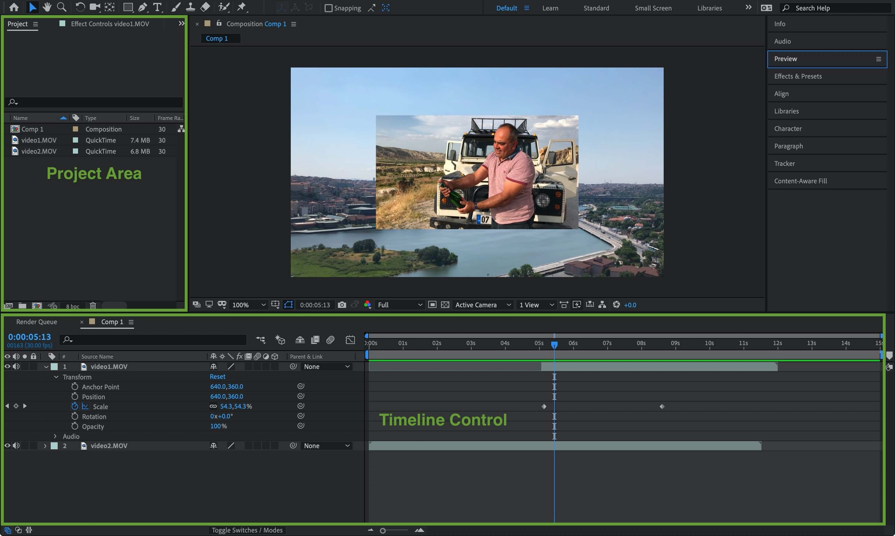

Let's break down this illustration: 

* Within the Project area, there is a composition named Comp1 of type Composition. A composition can be considered a creation in AE and can be played back and exported as a video. A composition can set parameters such as resolution, frame rate, background color, etc.
* Within the Timeline Control area, there are two layers with sources video1.MOV and video2.MOV. We can freely set the layer parameters, such as Transform (the example also has keyframe animation for Scale), Audio, and also freely move the layer in the right area. In addition, we can add a set of effects to each layer.

Based on the analysis of AE, we can design a similar description:

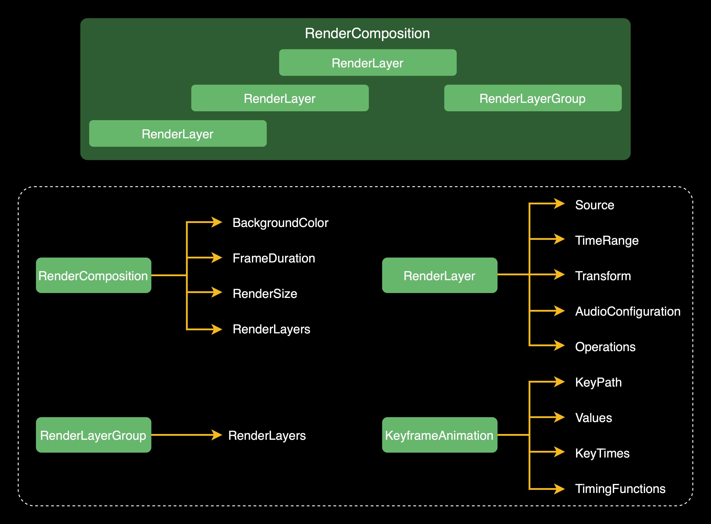

* `RenderComposition`, which corresponds to the composition in AE. Contains a set of `RenderLayer` (corresponds to Layer in AE). In addition, `RenderComposition` also contains `BackgroundColor`, `FrameDuration`, and `RenderSize`, which correspond to the background color, frame rate, and render size parameters.
* `RenderLayer`, which corresponds to the layer in AE. Contains `Source`, `TimeRange`, `Transform`, `AudioConfiguration`, `Operations`, which correspond to the source of the material, the time interval in the timeline, the transform (position, rotation, scaling), the audio configuration and the effects operations group. 
* `RenderLayerGroup`, which corresponds to AE pre-compositing. `RenderLayerGroup` inherits from `RenderLayer` and contains a group of `RenderLayers`.
* `KeyframeAnimation`, which corresponds to AE keyframe animation. Contains `KeyPath`, `Values`, `KeyTimes`, `TimingFunctions`, which correspond to key paths, value arrays, key time arrays, and easing functions arrays.

The above introduces `RenderComposition`, `RenderLayer`, `RenderLayerGroup` and `KeyframeAnimation`. As you know from the previous introduction to AVFoundation, we need to generate `AVPlayerItem` and `AVAssetExportSession` for playback and export. Therefore, we need to have an object that can parse these description objects and generate `AVPlayerItem` and `AVAssetExportSession` using AVFoundation's methods. The framework names this object `VideoLab`, which can be considered as a lab.

The overall workflow is as following:

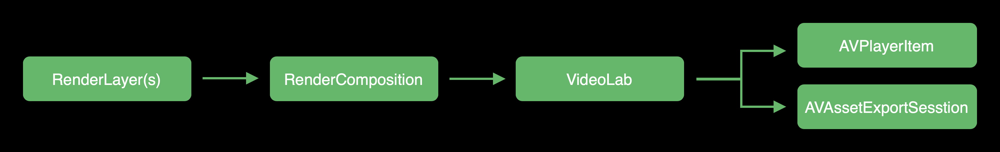

Let's break down the steps:

1. Create one or more `RenderLayers`.
2. Create a `RenderComposition` and set its `BackgroundColor`, `FrameDuration`, `RenderSize`, and `RenderLayer` arrays.
3. Create `VideoLab` with the created `RenderComposition`.
4. Use the created `VideoLab` to generate an `AVPlayerItem` or `AVAssetExportSession`.

This section introduces the design ideas of the framework. In general, we hope that the framework is designed in a flexible way like AE.

## Implementation of the framework

### Source

From the previous introduction, we know that a `RenderLayer` may contain a source of the material. Sources can be video, audio and still images, etc. The framework abstracts the `Source` protocol, and the following is the core code of the `Source` protocol:

```swift
public protocol Source {
    var selectedTimeRange: CMTimeRange { get set }
    
    func tracks(for type: AVMediaType) -> [AVAssetTrack]
    func texture(at time: CMTime) -> Texture?
}
```

* `selectedTimeRange` is the selected time range of the clip itself, for example, a 2-minute long video, we select the 60s-70s range for editing, the `selectedTimeRange` is [60s-70s) (in the code uses `CMTime`).
* `tracks(for:)` method for getting `AVAssetTrack` according to `AVMediaType`.
* `texture(at:)` method for getting `Texture` based on time.

The framework provides 4 built-in sources: 1. `AVAssetSource`, `AVAsset`。 2. `ImageSource`, still images. 3. `PHAssetVideoSource`, album videos. 4. `PHAssetImageSource`, album images. We can also implement the `Source` protocol to provide custom sources of material.

### AVComposition

So far we have learned about `RenderComposition`, `RenderLayer`, `RenderLayerGroup`, `KeyframeAnimation`, `Source`, next we will introduce how the `VideoLab` class uses these objects to create `AVComposition`, `AVVideoComposition` and `AVAudioMix`.

Let's start by looking at `AVComposition`, we need to add video tracks and audio tracks to `AVComposition`.

Let's illustrate this process with an example, as shown below, this `RenderComposition` has RenderLayer1 (contains video/audio), RenderLayer2 (video only), RenderLayer3 (image), RenderLayer4 (effects operation group only) and a `RenderLayerGroup` (contains RenderLayer5, RenderLayer6, both contain video/audio).

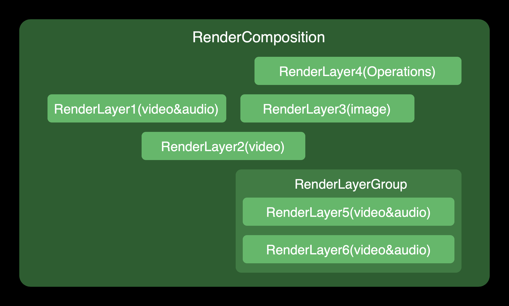

Let's start by adding video tracks. Adding video tracks consist of the following steps: 

**1. Converting a RenderLayer to a VideoRenderLayer**

`VideoRenderLayer` is an internal framework object that contains a `RenderLayer`, which is mainly responsible for adding the video track of the `RenderLayer` to the `AVComposition`. The `RenderLayer` that can be converted to `VideoRenderLayer` contains the following types: 1. `Source` contains the video track, 2. `Source` is the image type, 3. The effects operations group is not empty (`Operations`).

`VideoRenderLayerGroup` is an internal framework object that contains a `RenderLayerGroup`. A `RenderLayerGroup` that can be converted to a `VideoRenderLayerGroup` only needs to satisfy one condition: The contained `RenderLayer` group has one that can be converted to a `VideoRenderLayer`.

After converting the `VideoRenderLayer`, the result is as following: 

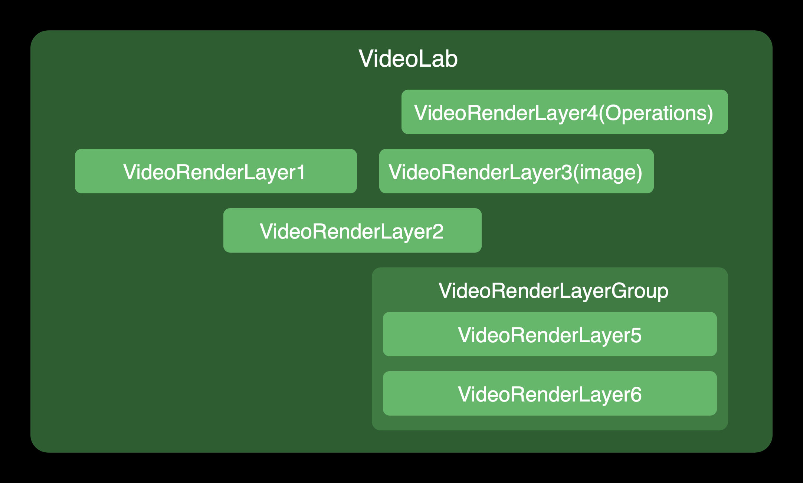

**2. Add VideoRenderLayer video track to AVComposition**

For `VideoRenderLayer` in which the `Source` of the `RenderLayer` contains a video track, get the video `AVAssetTrack` from the `Source` and add it to the `AVComposition`.

For `VideoRenderLayer` in which the `Source` of the `RenderLayer` is image type or a `VideoRenderLayer` that only has effects operations(`Source` is empty), add a new video track using the empty video (empty video is the video that the video track is a black frame and does not contain an audio track)

Once added, the video track of `AVComposition` will be shown as following: 

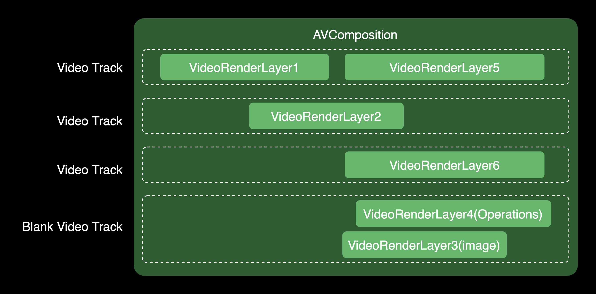

As shown in the illustration, VideoRenderLayer1 and VideoRenderLayer5 share one video track. This is because Apple has a limit on the number of video tracks, we need to reuse as many video tracks as possible (each video track corresponds to one decoder, when the number of decoders exceeds the system limit, there will be an error of not being able to decode).

The principle of video track reuse is, **if the VideoRenderLayer to be put in does not intersect with the VideoRenderLayer of the previous video track in time, then you can reuse this video track, and if all video tracks can't be reused then add a new video track.**

Let's move on to adding an audio track, which consists of the following steps.

**1. Converting a RenderLayer to an AudioRenderLayer**

`AudioRenderLayer` is an internal framework object that contains a `RenderLayer`, which is mainly responsible for adding the audio track of the `RenderLayer` to the `AVComposition`. The `RenderLayer` that can be converted to `AudioRenderLayer` only needs to satisfy one condition: the `Source` contains the audio track.

`AudioRenderLayerGroup` is an internal framework object that contains a `RenderLayerGroup`. A `RenderLayerGroup` that can be converted to an `AudioRenderLayerGroup` only needs to satisfy one condition: The contained `RenderLayer` group has one that can be converted to a `AudioRenderLayer`.

After converting the `AudioRenderLayer`, the result is as following: 

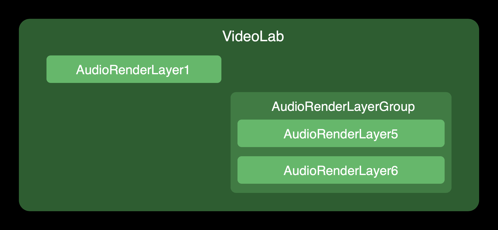

**2. Add AudioRenderLayer audio track to AVComposition**

For `AudioRenderLayer` in which the `Source` of the `RenderLayer` contains an audio track, get the audio `AVAssetTrack` from the `Source` and add it to the `AVComposition`.

Once added, the audio track of `AVComposition` will be shown as following: 

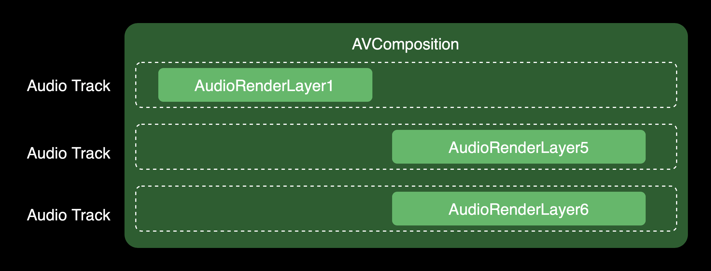

As shown, unlike the reuse of video tracks, each `AudioRenderLayer` corresponds to one audio track. This is because one `AVAudioMixInputParameters` corresponds to one audio track, and its pitch setting (`audioTimePitchAlgorithm`) acts on the whole audio track. If reused, there would be multiple `AudioRenderLayer` for one audio track, which would result in all `AudioRenderLayer` having to be configured with the same pitch, which is unreasonable.

### AVVideoComposition

As you know from the previous introduction to AVFoundation, `AVVideoComposition` can be used to specify the render size and render scaling, as well as the frame rate. In addition, there is a set of Instruction that stores the blending parameters. With these blending parameters, `AVVideoComposition` can be used to blend the corresponding image frames with a custom Compositor.

This section will focus on how to generate this set of Instructions and create `AVVideoComposition`. We will use the `VideoRenderLayer` generated in the previous section to generate this set of Instructions.

Let's illustrate this process with a simple example, as shown below, this `AVComposition` has VideoRenderLayer1, VideoRenderLayer2, and VideoRenderLayer3. The conversion process consists of the following steps: 

* Record the start and end time points of each `VideoRenderLayer` on the timeline (T1-T6 below).
* Create an Instruction for each time interval, and any `VideoRenderLayer` that intersects with the time interval is used as a blending parameter for the Instruction (Instruction1-Instruction5 below).

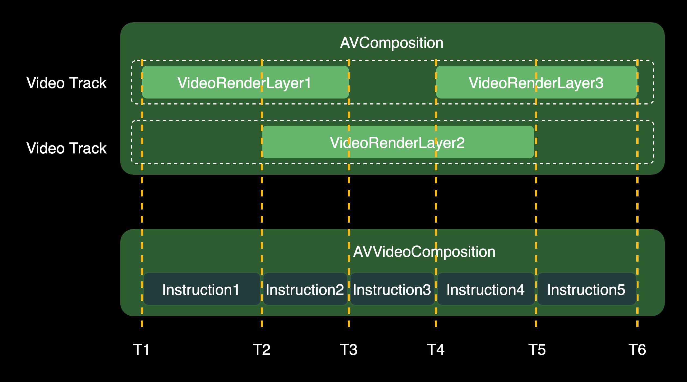

Then we create `AVVideoComposition` and set the frame rate, render size, Instruction set and custom Compositor. the core code is as following:

```swift
let videoComposition = AVMutableVideoComposition()
videoComposition.frameDuration = renderComposition.frameDuration
videoComposition.renderSize = renderComposition.renderSize
videoComposition.instructions = instructions
videoComposition.customVideoCompositorClass = VideoCompositor.self
```
So far we have the Instruction set and blending parameters needed for rendering, and we continue with how to use them to draw frames in the Compositor. We make an update to the previous Compositor workflow, updating the blending parameters to the `VideoRenderLayer` group that intersects with the Instruction.

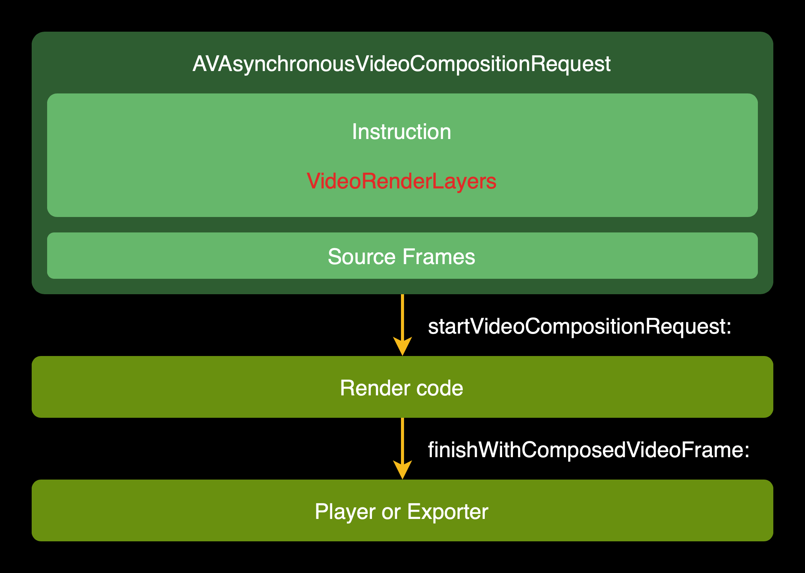

Let's also illustrate the rules for video blending with an example, as shown below, where we want to blend these `VideoRenderLayer` frames at the T1 time point.

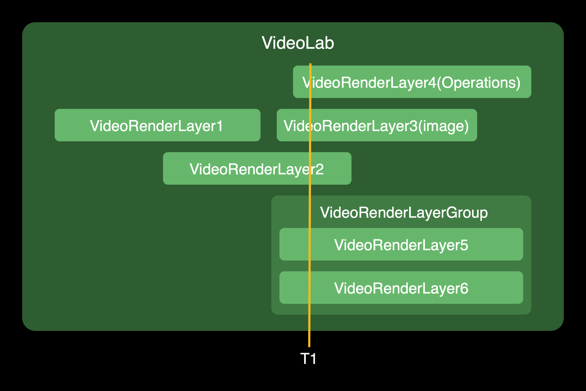

Our rendering blend rules are as following:

* Sort the `VideoRenderLayer` group according to the `layerLevel` of the `RenderLayer` it contains. As shown above.
* Iterate through the `VideoRenderLayer` group, for each `VideoRenderLayer` in the following three blends.
    * The current `VideoRenderLayer` is the `VideoRenderLayerGroup`, which is the precomposed way. After iterating through the `VideoRenderLayer` group inside itself, a texture is generated and blended to the previous texture.
    * The `Source` of the current `VideoRenderLayer` contains a video track or the `Source` is an image type, gets the texture to process its own effects operations group (Operations), and then blends it to the previous texture.
    * The current `VideoRenderLayer` has only the effects operations group, and all the operations are applied to the previous blended texture.

Rendering blending rules in summary, **Render by layer, bottom up. If the current layer has a texture, it processes its own texture first, and then blends into the previous texture. If there is no texture at the current level, the operation applies directly to the previous texture.**

Let's apply the rules to the example above, assuming our final output texture is Output Texture: 

1. Process the bottom VideoRenderLayerGroup to generate Texture1, and blend Texture1 into the Output Texture.
2. Process VideoRenderLayer2 to generate Texture 2, and blend Texture2 into the Output Texture.
3. Process VideoRenderLayer3 to generate Texture 3, and blend Texture3 into the Output Texture.
4. Process VideoRenderLayer4's effects operation group, which apply on the Output Texture.

### AVAudioMix

As you know from the previous introduction to AVFoundation, `AVAudioMix` is used to process audio. `AVAudioMix` contains a set of `AVAudioMixInputParameters` that can set `MTAudioProcessingTap` to process audio in real-time and `AVAudioTimePitchAlgorithm` to specify the pitch algorithm.

This section will focus on how to generate this set of `AVAudioMixInputParameters` and create `AVAudioMix`. We will use the `AudioRenderLayer` generated in the AVComposition section to generate this set of `AVAudioMixInputParameters`.

Let's illustrate this process with a simple example, as shown below, this `AVComposition` has `AudioRenderLayer1`, `AudioRenderLayer2` and `AudioRenderLayer3`. The conversion process consists of the following steps:

* For each `AudioRenderLayer` crates an `AVAudioMixInputParameters`.
* For each `AVAudioMixInputParameters` sets a `MTAudioProcessingTap`. The `MTAudioProcessingTap` is used to process audio in real-time, getting the audio configuration from the `RenderLayer`'s `AudioConfiguration` and calculating the volume at the current point time in real-time.
* For each `AVAudioMixInputParameters` sets `AVAudioTimePitchAlgorithm` . `AVAudioTimePitchAlgorithm` is used to set the pitch algorithm, and gets the pitch algorithm configuration from `RenderLayer`'s `AudioConfiguration`.

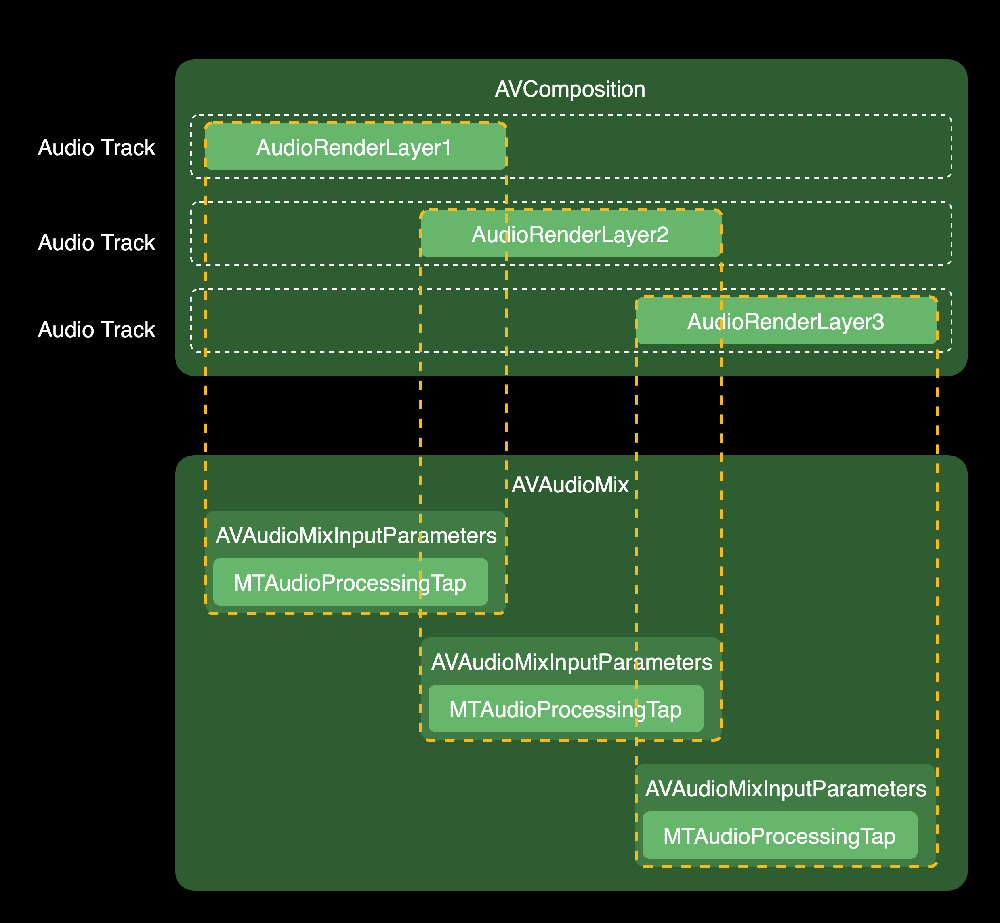

Then we create `AVAudioMix` and set the `AVAudioMixInputParameters` group. The code is as following:

```swift
let audioMix = AVMutableAudioMix()
audioMix.inputParameters = inputParameters
```

The above sections introduce the implementation of the framework, and the Metal part of the introduction will be considered in a subsequent article. The next few sections introduce the follow-up plan of the framework and recommended learning materials.

## Follow up plan

* Open GL rendering support (user decides whether to use Metal or Open GL for the rendering engine).
* Features continue to be added, such as speed change, easier way to use transitions (possibly by providing TransitionLayer), etc.
* Improve the demo and provide UI interactions.

## Recommended learning materials

### AVFoundation

* [WWDC 2012 - Real-Time Media Effects and Processing during Playback](https://developer.apple.com/videos/play/wwdc2012/517/)
* [WWDC 2013 - Advanced Editing with AV Foundation](https://developer.apple.com/videos/play/wwdc2013/612/)
* [WWDC 2020 - Edit and play back HDR video with AVFoundation](https://developer.apple.com/videos/play/wwdc2020/10009/)
* [AVFoundation Programming Guide](https://developer.apple.com/library/archive/documentation/AudioVideo/Conceptual/AVFoundationPG/Articles/00_Introduction.html)
* [Apple AVFoundation Collection](https://developer.apple.com/av-foundation/)
* [Apple Sample Code - AVCustomEdit](https://developer.apple.com/library/archive/samplecode/AVCustomEdit/Listings/AVCustomEdit_APLCustomVideoCompositor_m.html#//apple_ref/doc/uid/DTS40013411-AVCustomEdit_APLCustomVideoCompositor_m-DontLinkElementID_10)
* [Github - Cabbage](https://github.com/VideoFlint/Cabbage)

### Rendering

* [Learn OpenGL - Getting started](https://learnopengl.com/Introduction)
* [Apple Metal Collection](https://developer.apple.com/metal/)
* [Metal Best Practices Guide](https://developer.apple.com/library/archive/documentation/3DDrawing/Conceptual/MTLBestPracticesGuide/index.html#//apple_ref/doc/uid/TP40016642-CH27-SW1)
* [Metal by Tutorials](https://www.raywenderlich.com/books/metal-by-tutorials/v2.0)
* [Metal by Example](https://metalbyexample.com/category/advanced/)
* [小专栏 - iOS 图像处理(Chinese)](https://xiaozhuanlan.com/u/4926220611)
* [Github - GPUImage3](https://github.com/BradLarson/GPUImage3)

## Author

* BearRuan, currently working at RingCentral, ex-iOS Lead at Meipai
* ruanjingxiong@gmail.com


