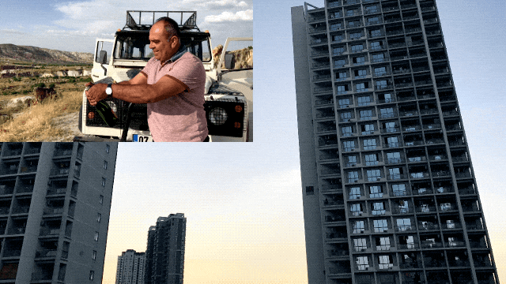

# VideoLab

[README 中文版本](./README-CN.md) 
[框架设计与实现介绍](./Document/README-DETAIL-CN.md)

High-performance and flexible video editing and effects framework, based on AVFoundation and Metal.

[Framework design and implementation](./Document/README-DETAIL-EN.md)

## Features

- [x] High-performance real-time video editing and exporting.
- [x] Highly free combination of video, image, audio.
- [x] Support audio pitch setting and volume adjustment.
- [x] Support CALayer vector animations, so complex text animations are supported.
- [x] Support keyframe animation.
- [x] Support After Effect-like pre-compose.
- [x] Support transitions.
- [x] Support custom effects. Such as LUT filter, zoom blur, etc.

The following are some GIFs of features(multiple layers, text animation, keyframe animation, pre compose, and transition)

<p align="left">
    
    
    
    
    
</p>

## Requirements

* iOS 11.0+
* Swift 5.0+

## Installation

VideoLab is available through [CocoaPods](https://cocoapods.org). Specify the following in your `Podfile`:

```ruby
source 'https://github.com/CocoaPods/Specs.git'
platform :ios, '11.0'
use_frameworks!

target '<Your Target>' do
  pod 'VideoLab'
end
```

## Usage

### Basic Concept

#### RenderLayer

`RenderLayer` is the most basic unit in the `VideoLab` framework. A video, image, audio can be a `RenderLayer`, or even just an effect can be a `RenderLayer`. `RenderLayer` is more like the concept of the layer in After Effect.

#### RenderComposition

`RenderComposition` works as a composite, can set frame rate, canvas size, contains multiple `RenderLayers`, can set `CALayer` to support vector animations.

#### VideoLab

`VideoLab` can be considered as a lab where `AVPlayerItem`, `AVAssetExportSession`, `AVAssetImageGenerator` can be generated according to `RenderComposition`.

### Basic Usage

```swift
// 1. Layer 1
var url = Bundle.main.url(forResource: "video1", withExtension: "MOV")
var asset = AVAsset(url: url!)
var source = AVAssetSource(asset: asset)
source.selectedTimeRange = CMTimeRange(start: CMTime.zero, duration: asset.duration)
var timeRange = source.selectedTimeRange
let renderLayer1 = RenderLayer(timeRange: timeRange, source: source)
    
// 1. Layer 2
url = Bundle.main.url(forResource: "video2", withExtension: "MOV")
asset = AVAsset(url: url!)
source = AVAssetSource(asset: asset)
source.selectedTimeRange = CMTimeRange(start: CMTime.zero, duration: asset.duration)
timeRange = source.selectedTimeRange
timeRange.start = CMTimeRangeGetEnd(renderLayer1.timeRange)
let renderLayer2 = RenderLayer(timeRange: timeRange, source: source)
    
// 2. Composition
let composition = RenderComposition()
composition.renderSize = CGSize(width: 1280, height: 720)
composition.layers = [renderLayer1, renderLayer2]

// 3. VideoLab
let videoLab = VideoLab(renderComposition: composition)

// 4. Make playerItem
let playerItem = videoLab.makePlayerItem()
```

1. Create `RenderLayer`
2. Create `RenderComposition`, set `renderSize` and `layers`
3. Create `VideoLab` with `renderComposition`
4. Make `AVPlayerItem` or `AVAssetExportSession`

### More Advanced Usage

#### Transform

```swift
var center = CGPoint(x: 0.25, y: 0.25)
var transform = Transform(center: center, rotation: 0, scale: 0.5)
renderLayer1.transform = transform
```

1. Create `Transform` with `center`, `rotation` and `scale`
2. `RenderLayer` set `transform`

#### Audio Configuration

```swift
let audioConfiguration = AudioConfiguration()
let volumeRampTimeRange = CMTimeRange(start: CMTime.zero, duration: CMTime(seconds: 5, preferredTimescale: 600))
let volumeRamp1 = VolumeRamp(startVolume: 0.0, endVolume: 0.0, timeRange: volumeRampTimeRange)
audioConfiguration.volumeRamps = [volumeRamp1]
renderLayer2.audioConfiguration = audioConfiguration
```

1. Create `AudioConfiguration`
2. Create `VolumeRamp` with `startVolume`, `endVolume` and `timeRange`
3. `AudioConfiguration` set `volumeRamps`
4. `RenderLayer` set `audioConfiguration`

#### CALayer Animation

For exporting set your customized `CALayer` for `RenderComposition`

```swift
composition.animationLayer = <Your customized CALayer>
```

For playback add `AVSynchronizedLayer` to your view's layer, See more detail in **Text Animation Demo**.

#### Keyframe Animation

```swift
// 1. Keyframe animation
let keyTimes = [CMTime(seconds: 2, preferredTimescale: 600),
                CMTime(seconds: 4, preferredTimescale: 600),
                CMTime(seconds: 6, preferredTimescale: 600)]
let animation = KeyframeAnimation(keyPath: "blendOpacity",
                                  values: [1.0, 0.2, 1.0],
                                  keyTimes: keyTimes, timingFunctions: [.linear, .linear])
renderLayer1.animations = [animation]
    
var transform = Transform.identity
let animation1 = KeyframeAnimation(keyPath: "scale",
                                   values: [1.0, 1.3, 1.0],
                                   keyTimes: keyTimes, timingFunctions: [.quadraticEaseInOut, .quadraticEaseInOut])
let animation2 = KeyframeAnimation(keyPath: "rotation",
                                   values: [0, Float.pi / 2.0, 0],
                                   keyTimes: keyTimes, timingFunctions: [.quadraticEaseInOut, .quadraticEaseInOut])
transform.animations = [animation1, animation2]
renderLayer1.transform = transform
```

1. Create `KeyframeAnimation` with `keyPath`, `values`, `keyTimes` and  `timingFunctions`
2. Set `animations` for a `struct` or `class` that implements the `Animatable` protocol (e.g. `Transform` struct, `RenderLayer` class)

#### RenderLayerGroup (After Effect-like pre-compose)

```swift
let layerGroup = RenderLayerGroup(timeRange: timeRange)
layerGroup.layers = [renderLayer1, renderLayer2]
```

1. Create `RenderLayerGroup` with `timeRange`
2. Set sub `layers` for `layerGroup`. See more detail in **Layer Group Demo**.

#### Transition

We don't have a transition layer, so instead, you can add a transform or operations to each RenderLayer to create a transition. See more detail in **Transition Demo**.

#### Custom Effects

```swift
// Filter
var filter = LookupFilter()
filter.addTexture(lutTextures[0], at: 0)
renderLayer.operations = [filter]

// Zoom Blur
var zoomblur = ZoomBlur()
animation = KeyframeAnimation(keyPath: "blurSize",
                              values: [0.0, 3.0],
                              keyTimes: keyTimes, timingFunctions: [.quarticEaseOut])
zoomblur.animations = [animation]
layerGroup1.operations = [zoomblur]
```

1. Create customize `Operation` inherited from `BasicOperation`. `BasicOperation` also conforms to the `Animatable` protocol
2. Set `operations` for `RenderLayer`.

## TODO

* Support Open GL render
* Add speed adjustment for `RenderLayer`.
* Provide a more convenient way to use transitions, possibly providing `TransitionLayer`.
* Add log system.

## Author

* BearRuan, ruanjingxiong@gmail.com
* Kay, kayyyuan@gmail.com

## License

VideoLab is available under the MIT license. See the [LICENSE](./LICENSE) file for more info.

